<!-- Bu dosya generate.mjs tarafından üretilir; elle düzenleme. / Generated by generate.mjs; do not edit by hand. -->

<a href="https://github.com/emrebayrakk"><picture><source media="(prefers-color-scheme: dark)" srcset="assets/en/switch-dark.svg"></picture></a>

<picture><source media="(prefers-color-scheme: dark)" srcset="assets/en/header-dark.svg">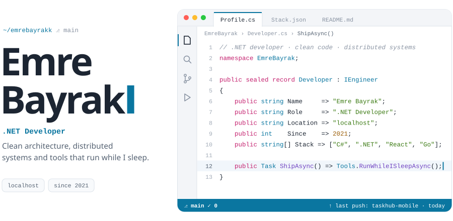</picture>

<a href="https://emrebayrak.com.tr"><picture><source media="(prefers-color-scheme: dark)" srcset="assets/link-web-dark.svg"></picture></a>
<a href="https://www.linkedin.com/in/eemmrree/"><picture><source media="(prefers-color-scheme: dark)" srcset="assets/link-linkedin-dark.svg"></picture></a>
<a href="https://www.instagram.com/dev.emrebayrak/"><picture><source media="(prefers-color-scheme: dark)" srcset="assets/link-instagram-dark.svg"></picture></a>

<picture><source media="(prefers-color-scheme: dark)" srcset="assets/en/region-now-dark.svg"></picture>

<a href="https://github.com/emrebayrakk?tab=repositories&sort=updated"><picture><source media="(prefers-color-scheme: dark)" srcset="assets/en/now-dark.svg">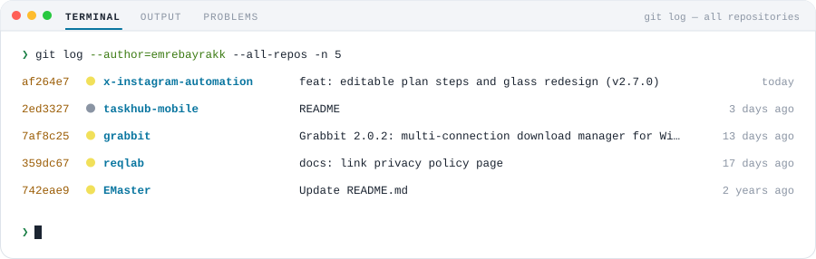</picture></a>

<picture><source media="(prefers-color-scheme: dark)" srcset="assets/en/region-pinned-dark.svg"></picture>

<a href="https://github.com/emrebayrakk/EMaster"><picture><source media="(prefers-color-scheme: dark)" srcset="assets/en/pin-EMaster-dark.svg">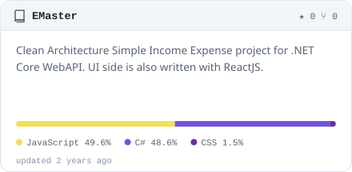</picture></a>
<a href="https://github.com/emrebayrakk/VehiclesControl"><picture><source media="(prefers-color-scheme: dark)" srcset="assets/en/pin-VehiclesControl-dark.svg">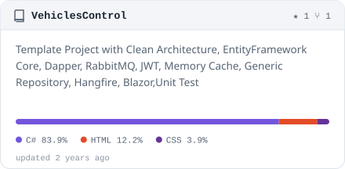</picture></a>

<a href="https://github.com/emrebayrakk/QuerySpecification"><picture><source media="(prefers-color-scheme: dark)" srcset="assets/en/pin-QuerySpecification-dark.svg">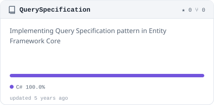</picture></a>
<a href="https://github.com/emrebayrakk/ElasticSearchDotnetMinimalAPI"><picture><source media="(prefers-color-scheme: dark)" srcset="assets/en/pin-ElasticSearchDotnetMinimalAPI-dark.svg">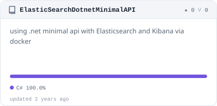</picture></a>

<a href="https://github.com/emrebayrakk/x-instagram-automation"><picture><source media="(prefers-color-scheme: dark)" srcset="assets/en/pin-x-instagram-automation-dark.svg">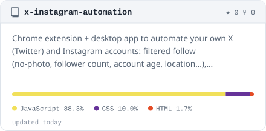</picture></a>
<a href="https://github.com/emrebayrakk/grabbit"><picture><source media="(prefers-color-scheme: dark)" srcset="assets/en/pin-grabbit-dark.svg">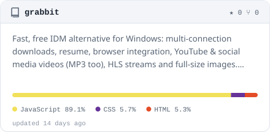</picture></a>

<a href="https://github.com/emrebayrakk?tab=repositories">all repositories →</a>

<picture><source media="(prefers-color-scheme: dark)" srcset="assets/en/region-langs-dark.svg"></picture>

<picture><source media="(prefers-color-scheme: dark)" srcset="assets/en/languages-dark.svg">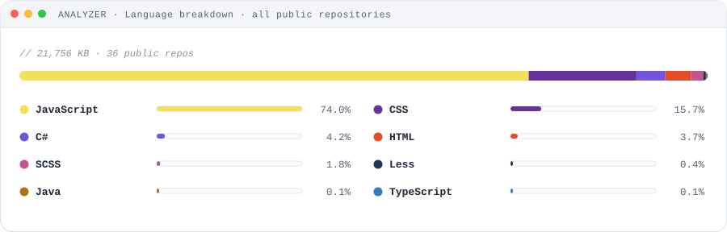</picture>

<picture><source media="(prefers-color-scheme: dark)" srcset="assets/en/region-tools-dark.svg"></picture>

<picture><source media="(prefers-color-scheme: dark)" srcset="assets/en/toolchain-dark.svg">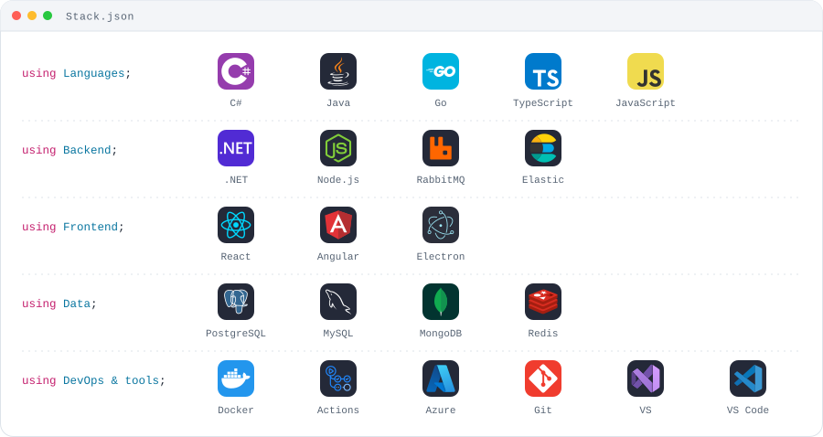</picture>

<picture><source media="(prefers-color-scheme: dark)" srcset="assets/en/region-stats-dark.svg"></picture>

<picture><source media="(prefers-color-scheme: dark)" srcset="assets/en/stats-dark.svg">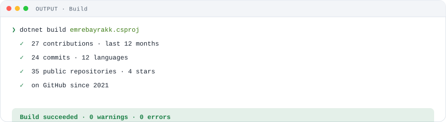</picture>

<picture><source media="(prefers-color-scheme: dark)" srcset="https://raw.githubusercontent.com/emrebayrakk/emrebayrakk/output/github-snake-dark.svg"></picture>

// auto-updated by generate.mjs + GitHub Actions · generated 2026-10-26

