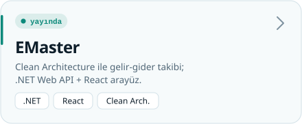
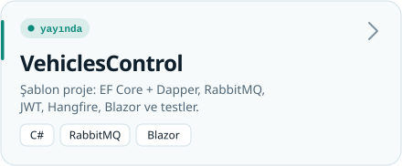
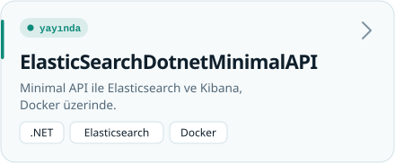
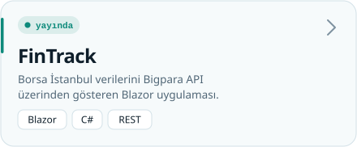
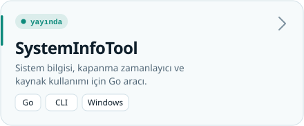

<a href="https://github.com/emrebayrakk/emrebayrakk/blob/main/README.en.md"><picture><source media="(prefers-color-scheme: dark)" srcset="assets/tr/switch-dark.svg"></picture></a>

<picture><source media="(prefers-color-scheme: dark)" srcset="assets/tr/header-dark.svg"></picture>

<a href="https://emrebayrak.com.tr"><picture><source media="(prefers-color-scheme: dark)" srcset="assets/link-web-dark.svg"></picture></a>
<a href="https://www.linkedin.com/in/eemmrree/"><picture><source media="(prefers-color-scheme: dark)" srcset="assets/link-linkedin-dark.svg"></picture></a>
<a href="https://www.instagram.com/dev.emrebayrak/"><picture><source media="(prefers-color-scheme: dark)" srcset="assets/link-instagram-dark.svg"></picture></a>

 

<picture><source media="(prefers-color-scheme: dark)" srcset="assets/tr/label-events-dark.svg"></picture>

<a href="https://github.com/emrebayrakk/x-instagram-automation"><picture><source media="(prefers-color-scheme: dark)" srcset="assets/tr/events-dark.svg"></picture></a>

  

<picture><source media="(prefers-color-scheme: dark)" srcset="assets/tr/label-services-dark.svg"></picture>

<a href="https://github.com/emrebayrakk/x-instagram-automation"><picture><source media="(prefers-color-scheme: dark)" srcset="assets/tr/service-x-instagram-automation-dark.svg"></picture></a>
<a href="https://github.com/emrebayrakk/EMaster"><picture><source media="(prefers-color-scheme: dark)" srcset="assets/tr/service-EMaster-dark.svg"></picture></a>

<a href="https://github.com/emrebayrakk/VehiclesControl"><picture><source media="(prefers-color-scheme: dark)" srcset="assets/tr/service-VehiclesControl-dark.svg"></picture></a>
<a href="https://github.com/emrebayrakk/ElasticSearchDotnetMinimalAPI"><picture><source media="(prefers-color-scheme: dark)" srcset="assets/tr/service-ElasticSearchDotnetMinimalAPI-dark.svg"></picture></a>

<a href="https://github.com/emrebayrakk/FinTrack"><picture><source media="(prefers-color-scheme: dark)" srcset="assets/tr/service-FinTrack-dark.svg"></picture></a>
<a href="https://github.com/emrebayrakk/SystemInfoTool"><picture><source media="(prefers-color-scheme: dark)" srcset="assets/tr/service-SystemInfoTool-dark.svg"></picture></a>

<a href="https://github.com/emrebayrakk?tab=repositories">tüm repolar →</a>

  

<picture><source media="(prefers-color-scheme: dark)" srcset="assets/tr/label-stack-dark.svg"></picture>

<picture><source media="(prefers-color-scheme: dark)" srcset="assets/tr/stack-dark.svg"></picture>

Teknolojilerimi bir isteğin izlediği yol gibi diziyorum: arayüzden girer, çekirdekte işlenir, veride kalır, kuyrukla dağılır.

  

<picture><source media="(prefers-color-scheme: dark)" srcset="assets/tr/label-telemetry-dark.svg"></picture>

<picture><source media="(prefers-color-scheme: dark)" srcset="https://github-readme-stats.vercel.app/api?username=emrebayrakk&show_icons=true&rank_icon=percentile&bg_color=00000000&hide_border=true&title_color=34d8c3&text_color=8aa2b3&icon_color=ff8a65&locale=tr"></picture>
<picture><source media="(prefers-color-scheme: dark)" srcset="https://github-readme-stats.vercel.app/api/top-langs/?username=emrebayrakk&layout=compact&langs_count=8&bg_color=00000000&hide_border=true&title_color=34d8c3&text_color=8aa2b3&icon_color=ff8a65&locale=tr"></picture>

<picture><source media="(prefers-color-scheme: dark)" srcset="https://raw.githubusercontent.com/emrebayrakk/emrebayrakk/output/github-snake-dark.svg"></picture>

// uğradığın için teşekkürler — emrebayrak.com.tr

